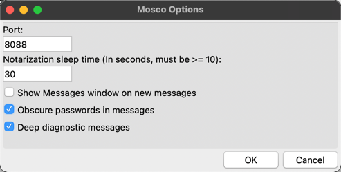
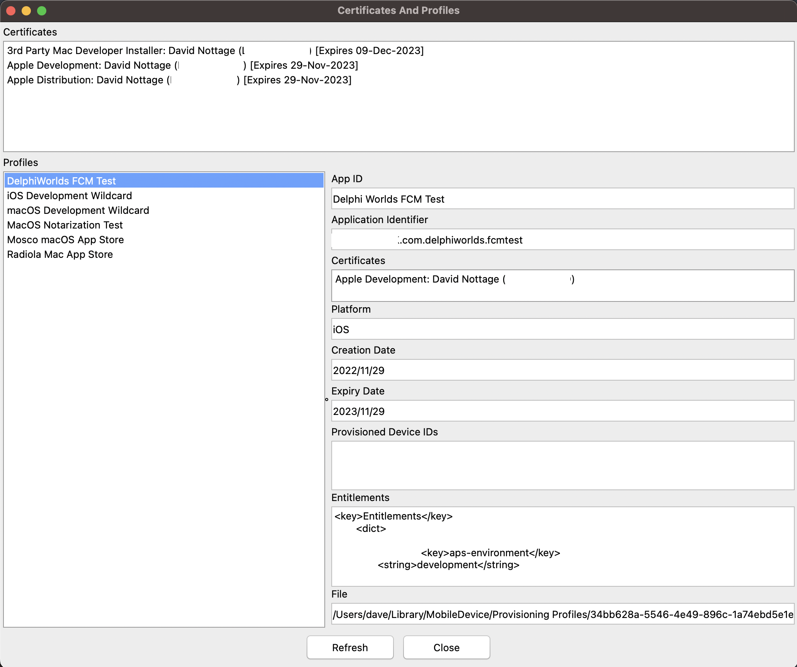
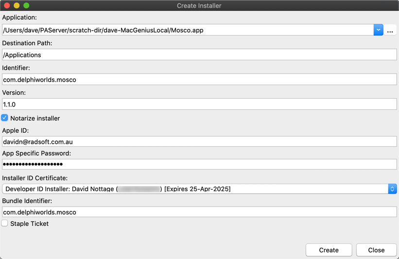
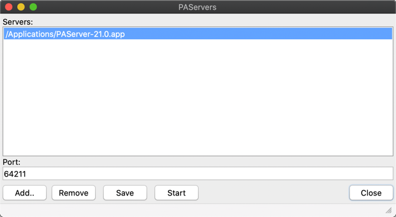

# Mosco

## Integration with Codex

The Delphi add-in Codex integrates with Mosco to perform various functions. Please consult the [Codex documentation](https://github.com/DelphiWorlds/Codex/blob/master/Docs/Readme.md) for details

## Mosco Menu

When Mosco starts, an icon appears in the macOS system bar. Click the icon to access the menu:

### Options

* Port: The port number that Mosco uses for the service that external tools like [Codex](https://github.com/DelphiWorlds/Codex) can communicate with
* Show Messages window on new messages: Determines whether Mosco will display the Messages window when new messages arrive
* Obscure passwords in messages means that command lines that contain a password will have the password obscured. Applies only to messages that appear *after* this option is turned on
* Deep diagnostic messages: Useful for when there may be a problem with Mosco

### View Certs & Profiles

Useful for determining which certificates are in the Keychain, when they are due to expire, and which profiles have been downloaded onto the Mac. Some of the functions:

* Right-clicking a certificate brings up a context menu that allows you to copy the certificate name to the clipboard
* Right-clicking a profile brings up a context menu that allows you to delete the profile
* Selecting a profile populates the profile details in the right-hand side panel

The Entitlements memo is useful for determining whether your profile uses an App ID that has the correct entitlements e.g. Push Notifications etc

### View Messages

The messages window displays messages logged by Mosco. This may be useful for determining which IP addresses Mosco may be listening on, when a device is connected/disconnected from the Mac, and for other diagnostics. When Deep diagnostic messages is enabled in the options, more messages will appear here to help diagnose any issues.

### Create Installer

This is a simple "front-end" for the pkgbuild command: https://www.manpagez.com/man/1/pkgbuild/

It allows you to select the app for which you wish to build an installer, as well as the destination path for installation (defaults to /Applications)

When an app is selected, it automatically determines what the Identifier is, as well as the version (if any)

The Notarize installer option allows you to notarize the installer so that users can install without having to grant permission via System Preferences. This option requires that you have a Developer ID Installer certificate installed on the Mac. The Staple Ticket option allows you to have the notarization authorization "stapled" to the installer so that the user does not need an internet connection for the Mac to verify that the installer is notarized.

### Notarize

This function is very similar to the Notarize process used by Delphi, with some differences. Mosco:

* Selects the first Developer ID Application certificate by default
* Queries the keychain for providers and selects the first by default. This negates the need for finding which valid providers you have when there is more than one (such as in a team environment)
* Uses the new notarytool command if available (Xcode 13 and later), which is much faster than the old process
* Pauses for 10 seconds between queries for whether Notarization has been completed, thus reducing network traffic (Delphi does this part a lot more often)

An explanation of the fields:

* Target: Select the application to be notarized
* Apple ID: The Apple ID to be used for notarization
* App Specific Password: An app specific password created on the Apple ID site: https://appleid.apple.com/. This password is sent **ONLY** to Apple's notarization process and is not used by Mosco in any other way
* Bundle Identifier: This value should be populated automatically when the Target is selected
* Providers: Select the provider that is appropriate for notarization of the app. It should be the one selected by default
* Staple Ticket: As per Create Installer, a ticket is "stapled" to the app so that the user does not need an internet connection for the Mac to verify that the app is notarized.

When you click Notarize, the current status of Notarization will appear at the bottom of the window. Please note that the process can take a few minutes, and that checking the status occurs every 30 seconds.

### PAServers

This menu item displays submenu items for each PAServer configured, so that the selected PAServer can be started easily

#### Configure

The Configure submenu item allows configuration of multiple PAServer items:

This is similar to PAServer Manager that is installed when you install PAServer, however this actually retains the settings when you start Mosco again

Click Add to add a server, and select the PAServer application (should be in the /Applications folder)

Change the Port value if necessary so as not to conflict with other server entries

Click Start to start the selected PASever, or Stop to stop it if already running